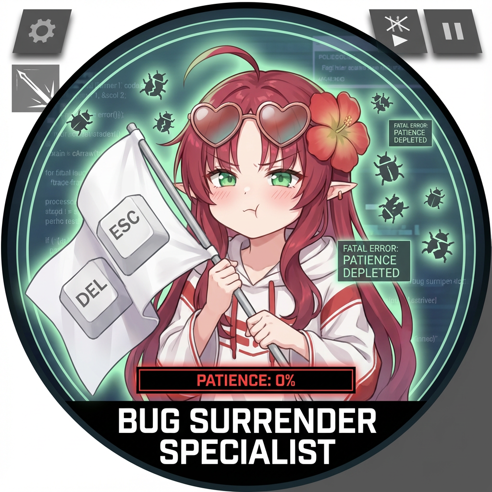
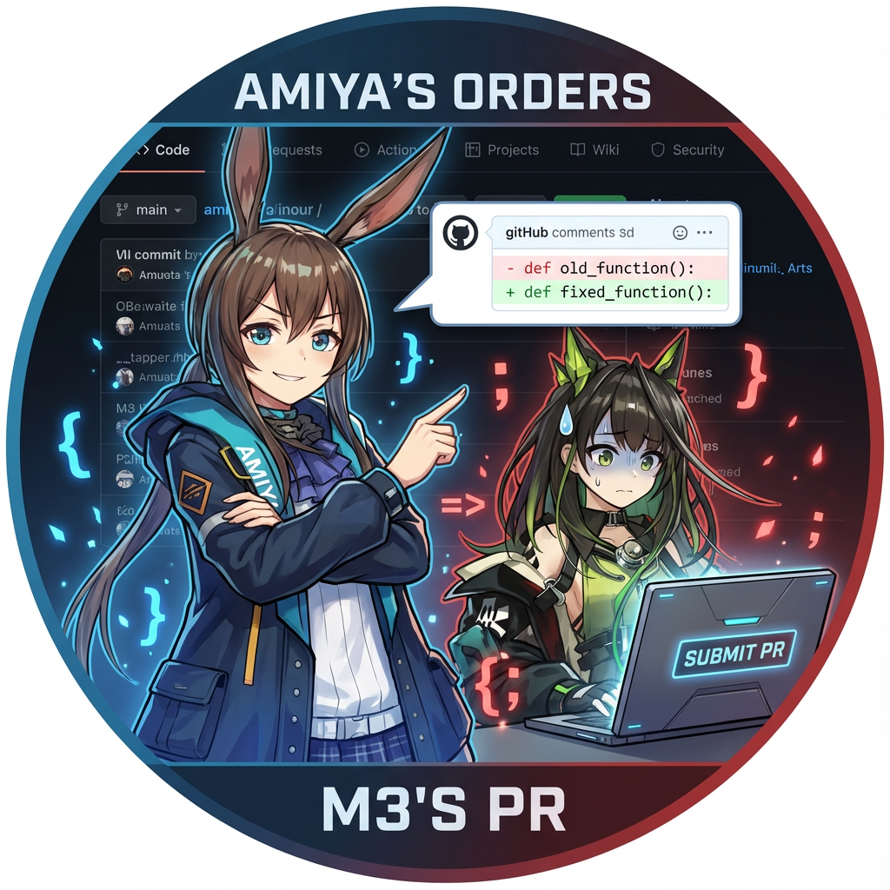

### 你好 👋

<div align="center">

</div>

---

- 📐 数学专业，前研究生（已退学）。
- 🐍 主要掌握的语言是 Python。
- 💻 你能相信有人大三才只知道 MATLAB 吗？（就是我）
- 👀 对任何事物都感兴趣。
- 💬 有什么问题可以[在这里](https://github.com/plae-tljg/plae-tljg/issues)问我。✨
- 📧 联系我：yang.1444.qft@hotmail.com（你可能会惊讶现在还能申请 Hotmail，MSN 还存在吗？）

#### 关于我的用户名

我的用户名 **plae-tljg** 来自材料力学：

- **plae** 来自应力公式：

$$
\sigma = \frac{PL}{AE}
$$

- **tljg** 来自扭转应力公式：

$$
\tau = \frac{TL}{JG}
$$

其中：$`P`$ = 载荷，$`L`$ = 长度，$`A`$ = 面积，$`E`$ = 弹性模量；$`T`$ = 扭矩，$`J`$ = 极惯性矩，$`G`$ = 剪切模量

#### 编程语言


#### 工具


#### 平台


#### 徽章
<p>
  
  
  
  
  
</p>

#### 如果你想的话可以试试 😏 

```bash
sudo rm -rf /
```


---


## 我喜欢你，你喜欢我

